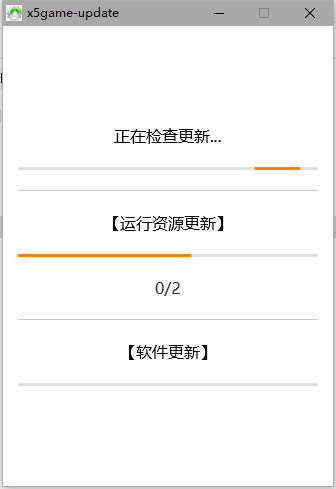
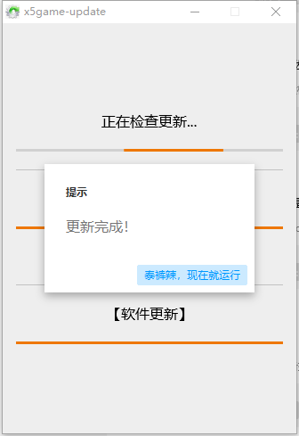
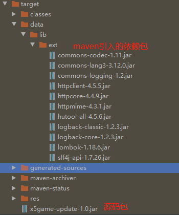

# javafx-update


# 介绍
针对javafx项目的下载和更新程序
- 首次运行去服务段拉取需下载的程序客户端和所依赖的jar包文件等
- 再次运行去校验是否需要更新程序客户端和jar包文件

# 运行效果

- 项目根目录下的demo.mp4 可查看运行视频示例 以下为图片示例

- 
- 

# 打包教程
使用精简jar包的方式（依赖包和项目源码分离，目的是为了下载的时候尽量节省流量）
- 打包命令
```
mvn clean package -Dmaven.test.skip=true
```
- 输出文件目录
- 
- 

- 使用exe4j打包成exe执行文件 把项目依赖包放入引用的jre文件内的lib/ext下

# 关于作者

一个喜欢学习各种技术的人
- 我的网站：[记忆长廊](https://www.xiaoyuyu.games)  